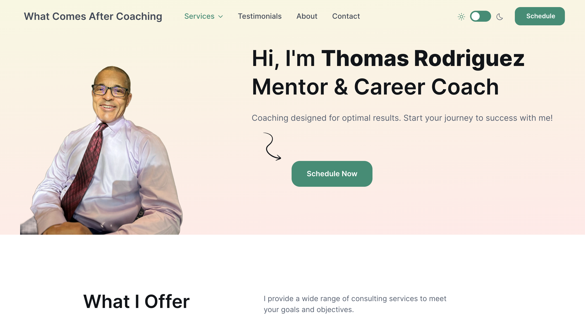

# What Comes After Coaching

**Link to project:** https://whatcomesaftercoaching.com/

## How It's Made:

**Tech used:**
   & Netlify

Client requested website using HTML for the content and structure, CSS for styling and formatting, and JavaScript for functionality. I chose Netlify for its simplicity and reputation amongst free tier web hosting. My goal was to create a My goal was to create a clean and simple design with Bootstrap for an easy user experience.

## Optimizations

I would have like to improve the performance of the website by Chrome's lighthouse standards. Another optimization to consider is to use Calendly's scheduler; however, this feature cost money we were not ready to spend. I would also like to add favicons and logos for the site once it's available.

## Lessons Learned:

**Business**

I learned more about how to communicate with my client. I started using Calendly to reduce the back and forth when we were trying to schedule meetings. I learned that the planning takes a long time, so I created a checklist for clients to go over as a type of homework.

**Website**

I learned how to implement SEO (metatags, links) and how to improve on accessability (create alt tags for every image) and performance (use webp for images). I also learned how to implement a DNS for the website.
